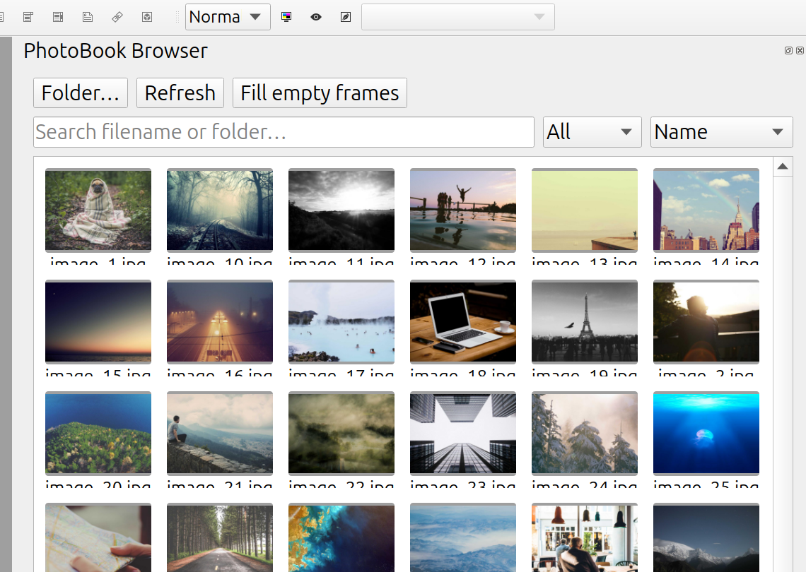
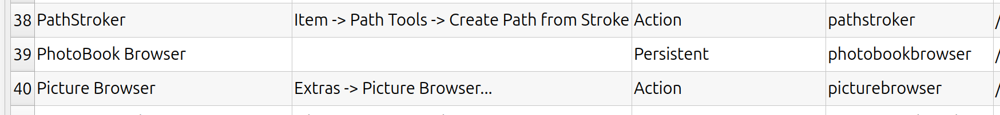

# Scribus PhotoBook Browser

**PhotoBook Browser** helps you create photo books in [Scribus](https://www.scribus.net/) without losing track of your images.

Browse your photos directly in Scribus, see which ones you have already used, and add images to your document with a click.



## Features

- Browse your photos as thumbnails
- Add photos directly to your Scribus document
- See which images are already used
- See which images are still unused
- Automatically keep the status up to date

## Download

[**Download the latest release →**](https://github.com/Uhrendoktor/scribus-photobookbrowser/releases)

Choose the download that matches your **Scribus version**.

Currently supported Scribus versions:

| Scribus |
|---|
| 1.7.0 |
| 1.7.1 |
| 1.7.2 |
| 1.7.3 |

> **Important:** Use the plugin that matches your Scribus version. Scribus 1.7.x is the development series leading toward Scribus 1.8.0.

## Installation

1. **Check your Scribus version**
   
   In Scribus, open **Help → About Scribus**.

2. **[Download the matching plugin](https://github.com/Uhrendoktor/scribus-photobookbrowser/releases)**

3. **Copy the `.so` file into your Scribus plugin folder.**

   The plugin path depends on your installation. For a typical Linux user installation:

   | | Linux | Windows | Mac |
   | --- | --- | --- | --- |
   | user | ~/.local/lib/scribus/plugins | - | - |
   | global | /usr/lib/scribus/plugins | C:\Program Files\Scribus [Version]\plugins\ | - |

   ```bash
   cp ~/Downloads/photobookbrowser*.so <path>/libphotobookbrowser.so
   ```

4. **Restart Scribus.**
5. Validate that the plugin was loaded correctly. Open **File → Preferences → Plugins** and check that the plugin was loaded.



If your Scribus installation uses a different plugin folder, place the file in that folder instead.

## Getting Started

1. Open your photo book in Scribus.
2. Open **PhotoBook Browser** from the Scribus **Windows** menu.
3. Select the folder containing your photos.
4. Browse your images.
5. Use the status indicator to see which photos are already in your document.
6. Select a photo to add it to your document.

The browser updates as you work, so you can use it as a simple visual checklist for your photo book.

## Building

The project builds against Scribus 1.7.x in Docker using Ubuntu 24.04 and Qt 6. The default local build target is Scribus 1.7.3.

```bash
SCRIBUS_VERSION=1.7.3 ./build-plugin.sh
```

CI builds the plugin against Scribus 1.7.0, 1.7.1, 1.7.2, and 1.7.3.

## Contributions

All contributions are welcome.
